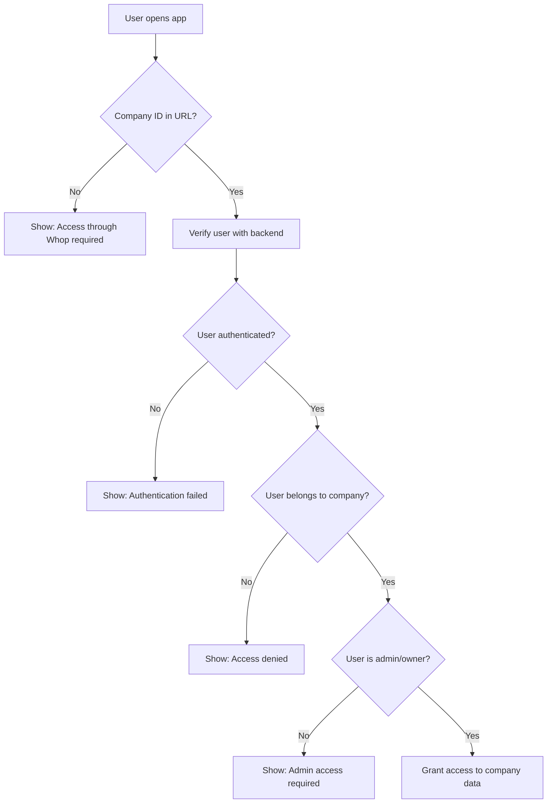

# Multi-Tenancy Implementation Guide

## 🎯 What is Multi-Tenancy?

Multi-tenancy means **each Whop company sees only their own data**. When Company A's admin logs in, they can ONLY see Company A's data. Company B cannot access Company A's data, even if they know the company ID.

## ✅ How It Works

### 1. **Company ID Detection**

When a user accesses your app through Whop:

```
User clicks app → Whop embeds app in iframe → Whop injects company ID
URL becomes: https://your-app.com?companyId=biz_abc123
```

**Whop App Configuration:**
```
App URL: https://data-analytics-gold.vercel.app?companyId={{COMPANY_ID}}
```

Whop automatically replaces `{{COMPANY_ID}}` with the actual company ID.

### 2. **User Authentication**

The `useWhopAuth()` hook performs these steps:

```typescript
const auth = useWhopAuth();

// Returns:
{
  userId: "user_123",           // Whop user ID
  companyId: "biz_abc",         // Company they're accessing
  isAuthenticated: true,        // User is logged in
  hasCompanyAccess: true,       // User belongs to this company
  accessLevel: "admin",         // Their role in the company
  isAdmin: true,                // Admin or owner
  isOwner: false,               // Company owner
  loading: false,               // Auth check complete
  error: null                   // No errors
}
```

### 3. **Access Control Flow**



### 4. **Backend Verification**

The frontend calls `/api/auth/permissions`:

```typescript
POST /api/auth/permissions
Body: { companyId: "biz_abc" }

Response:
{
  success: true,
  permissions: {
    userId: "user_123",
    isAuthorized: true,
    userRole: "admin"
  }
}
```

The backend:
1. Verifies the Whop user token (from headers)
2. Checks if user has access to the requested company
3. Verifies user role (admin/owner required)
4. Returns authorization status

## 🔐 Security Layers

### Layer 1: Frontend Access Control

```typescript
// app/analytics/page.tsx
const auth = useWhopAuth();

if (!auth.hasCompanyAccess) {
  return <AccessDenied />;
}

// User has access - show data
```

### Layer 2: Backend API Authorization

```typescript
// app/api/analytics/metrics/route.ts
const authResult = await authenticateWhopUser();

if (!authResult.isAdmin && !authResult.isOwner) {
  return NextResponse.json({ error: 'Forbidden' }, { status: 403 });
}
```

### Layer 3: Database Row-Level Security (RLS)

```sql
-- Each query automatically filtered by client_id
CREATE POLICY entities_own_data ON entities
  FOR ALL 
  USING (
    client_id IN (
      SELECT id FROM clients 
      WHERE company_id = current_setting('app.company_id')
    )
  );
```

## 📊 Data Isolation

### How It Works:

1. **Each company has a unique `company_id`** (e.g., `biz_3GYHNPbGkZCEky`)
2. **Each company has a `client_id`** in the database (UUID)
3. **All data is linked to `client_id`**:
   - `entities` table → `client_id`
   - `events` table → `client_id`
   - `form_templates` table → `client_id`
4. **All queries filter by `client_id`**

### Example Query:

```typescript
// Get students for THIS company only
const { data } = await supabase
  .from('entities')
  .select('*')
  .eq('client_id', clientId)  // ← Filters by company
  .order('created_at', { ascending: false });
```

## 🎯 Complete Flow Example

### Scenario: Company A's admin accesses analytics

1. **User clicks analytics in Whop**
   - URL: `https://data-analytics-gold.vercel.app?companyId=biz_CompanyA`

2. **Frontend authenticates**
   ```typescript
   const auth = useWhopAuth();
   // Detects companyId from URL
   // Calls /api/auth/permissions
   ```

3. **Backend verifies**
   ```typescript
   // Verifies Whop user token
   const userId = await whopSdk.verifyUserToken(headers);
   
   // Checks company access
   const access = await whopSdk.access.checkIfUserHasAccessToCompany({
     userId: "user_123",
     companyId: "biz_CompanyA"
   });
   
   // access.hasAccess = true
   // access.accessLevel = "admin"
   ```

4. **Frontend granted access**
   ```typescript
   auth.hasCompanyAccess = true
   auth.companyId = "biz_CompanyA"
   auth.isAdmin = true
   ```

5. **Data fetched**
   ```typescript
   // Fetch analytics for biz_CompanyA
   GET /api/analytics/metrics?companyId=biz_CompanyA
   
   // Returns ONLY Company A's data
   // Company B, C, D data is completely isolated
   ```

### What if Company A tries to access Company B's data?

```typescript
// Malicious attempt
GET /api/analytics/metrics?companyId=biz_CompanyB

// Backend checks:
const access = await whopSdk.access.checkIfUserHasAccessToCompany({
  userId: "user_123",        // Company A's user
  companyId: "biz_CompanyB"  // Trying to access Company B
});

// access.hasAccess = false ❌
// Returns 403 Forbidden
```

## 🧪 Testing Multi-Tenancy

### Test 1: Access with Valid Company ID

```bash
https://data-analytics-gold.vercel.app?companyId=biz_3GYHNPbGkZCEky
```

**Expected:**
- ✅ Authentication succeeds
- ✅ Access granted
- ✅ See company data

### Test 2: Access without Company ID

```bash
https://data-analytics-gold.vercel.app
```

**Expected:**
- ❌ Shows: "No company context found"
- ❌ Access denied
- ℹ️ Instructions to add ?companyId=

### Test 3: Access Different Company (Not yours)

```bash
https://data-analytics-gold.vercel.app?companyId=biz_SomeOtherCompany
```

**Expected:**
- ❌ Authentication fails
- ❌ Shows: "Access denied - you don't belong to this company"
- ❌ No data visible

### Test 4: Non-Admin User

If user is a member (not admin/owner):

**Expected:**
- ✅ Authentication succeeds
- ❌ Shows: "Only admins and owners can access analytics"
- ❌ No data visible

## 🎛️ Configuration Checklist

### 1. Whop App Settings

- [ ] Go to https://whop.com/apps
- [ ] Find your app
- [ ] Set App URL to: `https://data-analytics-gold.vercel.app?companyId={{COMPANY_ID}}`
- [ ] Save changes
- [ ] Test by opening app from a Whop group

### 2. Environment Variables (Vercel)

- [ ] `NEXT_PUBLIC_WHOP_APP_ID` = Your Whop app ID
- [ ] `WHOP_API_KEY` = Your Whop API key
- [ ] `NEXT_PUBLIC_WHOP_AGENT_USER_ID` = Agent user ID
- [ ] `NEXT_PUBLIC_WHOP_COMPANY_ID` = Fallback for development

### 3. Database Setup

- [ ] RLS policies enabled on all tables
- [ ] Each table has `client_id` column
- [ ] `clients` table maps `company_id` to `client_id`

### 4. API Routes

- [ ] All API routes verify authentication
- [ ] All API routes check company access
- [ ] All API routes filter data by `client_id`

## 📈 Monitoring Multi-Tenancy

### Check Browser Console

Look for these logs:

**Good:**
```
✅ Company ID from URL: biz_3GYHNPbGkZCEky
📊 Fetching data for company: biz_3GYHNPbGkZCEky
```

**Bad:**
```
❌ No company ID found
❌ Authentication failed
❌ Access denied
```

### Check Network Tab

Look for API calls:
```
/api/auth/permissions → Should return 200
/api/analytics/metrics?companyId=biz_xxx → Should return 200
```

## 🚨 Common Issues

### Issue 1: "No company context found"

**Cause:** App URL not configured in Whop
**Fix:** Set App URL to include `?companyId={{COMPANY_ID}}`

### Issue 2: "Access denied"

**Cause:** User doesn't belong to this company
**Fix:** Verify user is a member of the company in Whop

### Issue 3: "Only admins can access"

**Cause:** User is a member, not admin/owner
**Fix:** Promote user to admin in Whop company settings

### Issue 4: See all companies' data

**Cause:** RLS policies not working
**Fix:** Check database RLS policies and `client_id` filtering

## ✅ Success Criteria

Your multi-tenancy is working if:

1. ✅ Each company sees only their data
2. ✅ Cannot access another company by changing URL
3. ✅ Only admins/owners have access
4. ✅ Members are denied access
5. ✅ Authentication required for all pages
6. ✅ Database queries filtered by `client_id`
7. ✅ RLS policies enforced

## 📚 Code References

- **Frontend Auth:** `lib/hooks/useWhopAuth.ts`
- **Backend Auth:** `lib/auth/whop-auth-proper.ts`
- **Analytics Page:** `app/analytics/page.tsx`
- **API Permissions:** `app/api/auth/permissions/route.ts`
- **Database Schema:** `database/01-schema.sql`
- **RLS Policies:** `database/02-rls-policies.sql`

---

**Your app now has complete multi-tenancy! Each company is completely isolated with proper authentication and authorization.** 🎉

